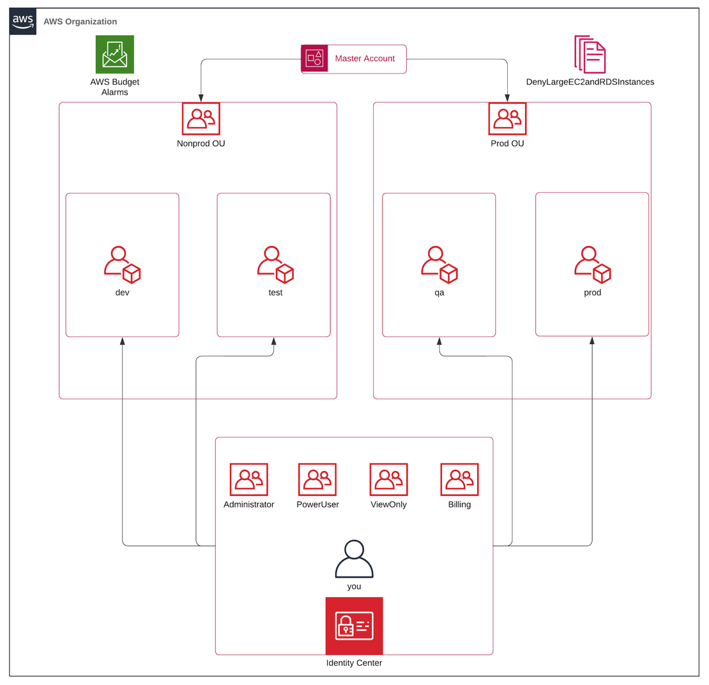

# AWS Landing Zone

## Overview

This module creates a basic AWS Landing Zone. Geared mostly towards solo devs and small teams, this module creates:
1. AWS Organization
2. Organizational Units (OU)
- nonprod
- prod
3. AWS accounts
- dev
- test
- qa
- prod
4. A single IAM Identity Center user who can assume the following roles in the given accounts:
- Administrator
- PowerUser
- ViewOnly
- Billing
5. A Budget with 2 notification thresholds:
- Forecasted spend is > 100% of monthly budget
- Actual spend is > 100% of monthly budget
6. An SCP that denies creation of large EC2 and RDS instances. It's a skeleton implementation and can be customized as needed.

## Prerequisites
Due to some limitations of the AWS API, and the fact that you simply have to manually create a new account,
there are some prerequisites that you need to have in place before you can use this module and during the provisioning
process.
1. You must create a brand new AWS account. This has not been tested with existing accounts.
2. Set up MFA on your root user immediately after creating the account.
3. Create a new IAM user with admin permissions and enable MFA, only programmatic access is needed.
4. Generate an access key for the new user, this will generate an `AWS_ACCESS_KEY_ID` and `AWS_SECRET_ACCESS_KEY`.
5. In your terminal, export those two values as the following environment variables.

```shell
export AWS_ACCESS_KEY_ID="your_access_key"
export AWS_SECRET_ACCESS_KEY="your_secret"
```

6. In your terminal, run `aws sts get-caller-identity` to verify that your credentials are working.
---

## Deploying the Landing Zone
Deploying this TF repo is a multistep process due to AWS API limitations. Namely, the inability to enable Identity Center
through the API. As above, you should/must manually enable MFA on the users created.

1. Open `terraform.auto.tfvars` and fill in the required and optional variables.
2. Comment out the `identity_center.tf` file.
3. Run `terraform init` to initialize the resources.
4. Run `terraform apply` to create the resources.

After that `apply` is finished, you must log into the AWS console and enable Identity Center in the master account. Then...

5. Uncomment the `identity_center.tf` file.
6. Run `terraform init` to initialize the resources.
7. Run `terraform apply` to create the resources.
8. After that `apply` is finished, you should have a fully functional AWS Landing Zone.
---
## Post Deployment
Now that you have your Identity Center user created, you can delete the previously created IAM user by logging into your
master account as the root user. While still in the console, navigate back to the Identity Center and set your custom login URL. It
should be in a column on the right hand side. Once this is set, you can log out and log back in using your new Identity
Center URL as your Identity Center user. You'll have to click "Forgot Password" to create the password, then you'll be
prompted to setup MFA.

**Note:** Make sure you're in the same region you specified in your `terraform.auto.tfvars` file.